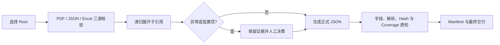

# AI 辅助技术文档数据治理与质量验收

这是一个面向技术文档引用关系的 AI 辅助数据治理项目。项目将 PDF、已有 JSON 与人工 Excel 清单进行多源对齐，把多层引用关系整理为可追溯的树状 JSON 交付，并通过人工决策与机器质检共同控制风险。

本仓库是用于公开作品集与教师审阅的**脱敏重构版**。所有示例均为合成数据；真实工程图、技术规格、OCR 文本、客户标识、引用关系、本机路径和精确派生统计均未上传。

## 可核验结果

| 指标 | 公开结果 | 严格含义 |
| --- | --- | --- |
| Root 引用树 | 数十棵 | 多个独立根文档范围 |
| 树内正式 JSON 记录 | 数百条 | 去重前的树级文件出现次数 |
| 最终正式 JSON | 百余份 | 原交付按原始文件 SHA-256 归并后的文件 |
| 同名、字节不同的候选版本 | 多组 | 保留并重命名，避免按文件名直接覆盖 |
| 机器完整性检查 | 全部通过 | 仅证明解析、命名和映射完整性 |
| 规范化语义复审 | 发现多组重复 | 说明字节级去重不等于语义唯一 |

源缓存、树内出现次数、按字节归并的交付文件与规范化对象是不同总体，不能描述成单一的“清洗前—清洗后”漏斗。原交付的去重依据是文件原始字节 hash，而不是 JSON 解析后的规范化对象。

## 我的职责与 AI 边界

我负责将模糊任务拆解为可执行流程，定义证据优先级、引用与终端叶子口径、异常分流、去重策略、人工兜底和最终验收；AI 工具辅助批量读取、初步抽取、比对、树结构整理和报告草拟。关键争议与最终交付责任由我承担。

项目使用了多个范围隔离的 AI 会话并行处理不同 root 区间，并通过写入边界、worker 报告和总控复核避免互相覆盖。这是 AI 辅助工作流设计，不是一个已上线的多智能体平台。

## 工作流



## 仓库导航

- [`docs/PROJECT_REVIEW_BRIEF_ZH.md`](docs/PROJECT_REVIEW_BRIEF_ZH.md)：给老师的项目速览。
- [`docs/EVIDENCE_AND_CLAIMS.md`](docs/EVIDENCE_AND_CLAIMS.md)：证据状态与可对外主张。
- [`docs/WORKFLOW_AND_DECISIONS.md`](docs/WORKFLOW_AND_DECISIONS.md)：流程、异常规则和项目管理方法。
- [`docs/DATA_DICTIONARY.md`](docs/DATA_DICTIONARY.md)：交付字段与质量口径。
- [`docs/RESUME_AND_INTERVIEW_ZH.md`](docs/RESUME_AND_INTERVIEW_ZH.md)：简历 bullet 和面试讲法。
- [`docs/KNOWN_LIMITATIONS.md`](docs/KNOWN_LIMITATIONS.md)：不能外推的结论。
- [`examples/synthetic/`](examples/synthetic/)：完全虚构的可运行演示数据。

## 本地验证

```bash
python scripts/security_scan.py
python scripts/verify_demo.py
```

两项脚本均只使用 Python 标准库。它们用于验证本仓库的安全边界和合成样例，不是原项目当时完整使用的生产流水线。

## 事实边界

- 可以证明：项目量级、解析、允许字段集合、文件名冲突、原始字节 hash、manifest 与 coverage 映射。
- 部分可证明：人机协同流程、并行会话分工、人工决策与短周期交付时间线。
- 不能证明：99% 语义准确率、逐页人工金标准核验、业务效率提升比例、真实用户采用或生产上线。

更准确的定位是“数据质量治理与 AI 工作流落地”，不是传统 BI/统计建模项目，也不是完整 AI 产品开发。

公开访问不等于授予开源或商业复用许可，详见 [LICENSE.md](LICENSE.md) 与 [RIGHTS_AND_REUSE.md](RIGHTS_AND_REUSE.md)。
